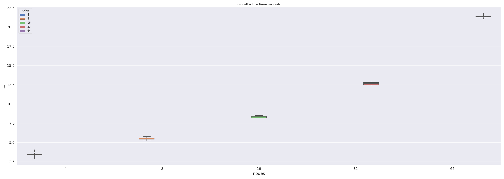
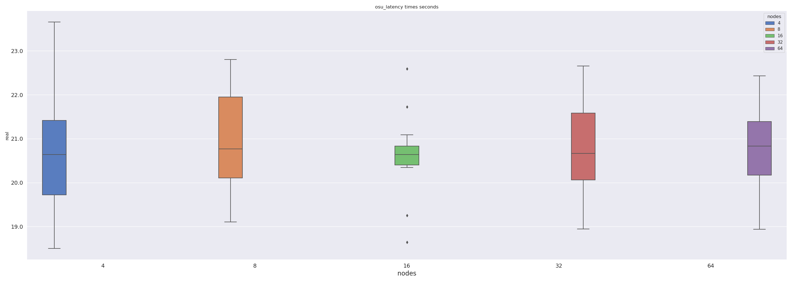
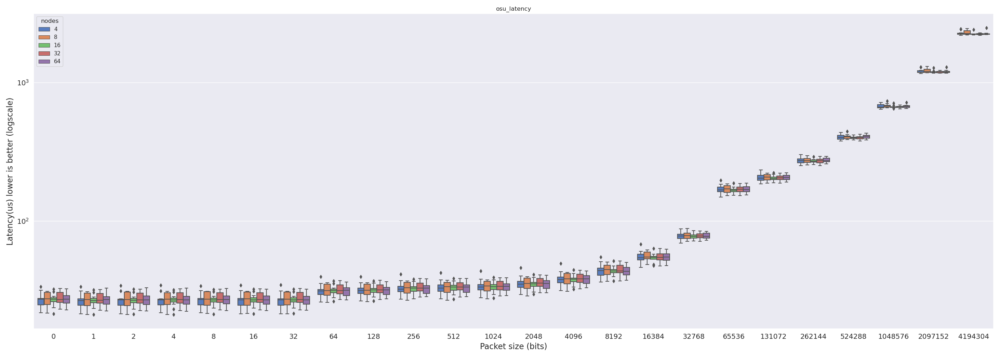
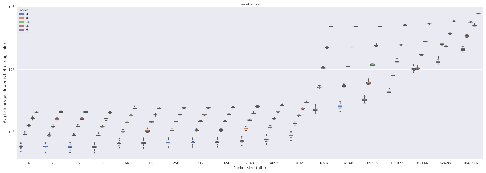
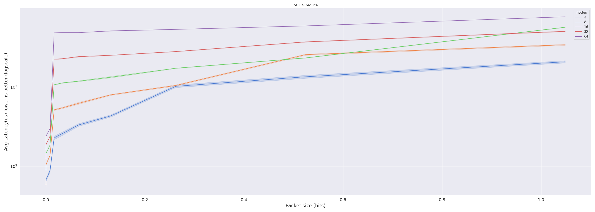

# OSU Experiments

> Running on c2d-standard-56

We ran our [official set for run4](../run4) but then noticed that the c3 instance type
wouldn't run lammps (and c2d would) so we want to re-run them here with this instance
type to see if the network is better.

## OSU Benchmarks

Note that we will be using this configuration (66 nodes) is ~$168/hour (rounded up)
I started runs at 5pm. I should not go beyond 5 hours (10pm).


```bash
GOOGLE_PROJECT=llnl-flux

# Add two nodes for jobset and metrics operator
gcloud compute networks create mtu9k --mtu=8896 
gcloud container clusters create osu-cluster \
    --threads-per-core=1 \
    --placement-type=COMPACT \
    --num-nodes=66 \
    --network-performance-configs=total-egress-bandwidth-tier=TIER_1 \
    --machine-type=c2d-standard-56 \
    --region=us-central1-a \
    --enable-gvnic \
    --network=mtu9k \
    --system-config-from-file=./crd/system-config.yaml
```

Install JobSet

```bash
VERSION=v0.2.0
kubectl apply --server-side -f https://github.com/kubernetes-sigs/jobset/releases/download/$VERSION/manifests.yaml
```

Install the metrics operator. Here we keep the exact version and digest.

```bash
kubectl apply -f https://raw.githubusercontent.com/converged-computing/metrics-operator/main/examples/dist/metrics-operator.yaml
```

Save some metadata about the nodes:

```bash
mkdir -p ./results
kubectl get nodes -o json > results/nodes.json
```

Install the Metrics Operator SDK. Version 19 has added support for custom (raw) log parsing.

```bash
pip install metricsoperator==0.0.2
# or with plotting libraries for later
pip install -r requirements.txt
```

### Experiments

The following experiments will be run! It's useful to do a test first to sanity check output, etc.

```bash
kubectl  apply -f crd/metrics-4.yaml 
kubectl  delete -f crd/metrics-4.yaml 
```

#### Actual Runs

Now we can automate many different runs with the script. Note that we target a directory of CRD, so you can target each combination
of size and iterations (which varies).

```bash
python run-experiment.py --out ./data --input ./crd/metrics-64-ptp.yaml --iter 12 --sleep 60
python run-experiment.py --out ./data --input ./crd/metrics-64.yaml --iter 12 --sleep 5
python run-experiment.py --out ./data --input ./crd/metrics-32-ptp.yaml --iter 12 --sleep 5
python run-experiment.py --out ./data --input ./crd/metrics-32.yaml --iter 12 --sleep 5
python run-experiment.py --out ./data --input ./crd/metrics-16-ptp.yaml --iter 12 --sleep 5
python run-experiment.py --out ./data --input ./crd/metrics-16.yaml --iter 12 --sleep 5
python run-experiment.py --out ./data --input ./crd/metrics-8-ptp.yaml --iter 12 --sleep 5
python run-experiment.py --out ./data --input ./crd/metrics-8.yaml --iter 12 --sleep 5
python run-experiment.py --out ./data --input ./crd/metrics-4-ptp.yaml --iter 12 --sleep 5
python run-experiment.py --out ./data --input ./crd/metrics-4.yaml --iter 12 --sleep 5
```

```bash
gcloud container clusters delete osu-cluster --region us-central1-a
```

### Results

We have a script to parse results into data frames and images.

```bash
python plot-times.py --results ./data --out ./img
```

For full test descriptions, see the accordians under [C Benchmarks at the bottom of this page](https://mvapich.cse.ohio-state.edu/benchmarks/). I added most of them here because I think it's important to quickly see what the tests mean and are measuring and how they work.

#### Wrapped Times

Since we had incredibly slow times the first time around, I decided to do the same here (and make plots for that).
We didn't see any weirdness this time - as expected, for each metric the time to run it increased with increasing size.
These plots are the real times, in seconds, across sizes.
I'm including an example comparison between the testing run and this one - it's alarming (4+ hours difference)

<details>

<summary>Alarming difference between two different 64 clusters</summary>

```console
time mpirun --hostfile ./hostlist.txt --allow-run-as-root -np 64 -map-by ppr:1:node -rank-by core /opt/osu-benchmark/build.openmpi/libexec/osu-micro-benchmarks/mpi/collective/osu_allgather

# OSU MPI Allgather Latency Test v5.8
# Size       Avg Latency(us)
1                  256153.75
2                  256419.24
4                  255733.85
8                  257292.16
16                 256089.31
32                 256481.62
64                 255988.02
128                257387.12
256                256602.52
512                257588.14
1024              1308098.70
2048              1306422.61
4096              1311518.21
8192              1311357.26
16384             1315375.37
32768             3600736.73
65536             3715001.02
131072            3720411.73
262144            3792049.28
524288            3951282.13
1048576           5553244.52

real	261m44.303s
user	36m49.467s
sys	219m10.878s

```

osu_allgather on 64 nodes for this run (even faster) (formatted into json with the better automation this time)

```console
            "time mpirun --hostfile ./hostlist.txt --allow-run-as-root -np 64 -map-by ppr:1:node -rank-by core /opt/osu-benchmark/
build.openmpi/libexec/osu-micro-benchmarks/mpi/collective/osu_allgather",
            "# OSU MPI Allgather Latency Test v5.8",
            "# Size       Avg Latency(us)",
            "1                     726.78",
            "2                     883.14",
            "4                     738.37",
            "8                     834.10",
            "16                    741.27",
            "32                    991.50",
            "64                    998.09",
            "128                   962.28",
            "256                   895.28",
            "512                   946.23",
            "1024                 4130.64",
            "2048                 4279.99",
            "4096                 4376.05",
            "8192                 5513.11",
            "16384                6569.73",
            "32768               20212.10",
            "65536               25610.89",
            "131072              30649.87",
            "262144              46786.95",
            "524288              81370.22",
            "1048576            147033.37",
            "real\t1m39.490s",
            "user\t0m12.951s",
            "sys\t1m23.471s",
```

You can see the first (the testing cluster) was over 4 hours, and the second was under 2 minutes. I don't know how to explain
this.

</details>

##### osu_acc_latency

> Latency Test for Accumulate with Active/Passive Synchronization. The accumulate latency benchmark includes window initialization operations (MPI_Win_create, MPI_Win_allocate and MPI_Win_create_dynamic) and synchronization operations (MPI_Win_lock/unlock, MPI_Win_flush, MPI_Win_flush_local, MPI_Win_lock_all/unlock_all, MPI_Win_Post/Start/Complete/Wait and MPI_Win_fence). For active synchronization, suppose users run with MPI_Win_Post/Start/Complete/Wait, the origin process calls MPI_Accumulate to combine data from the local buffer with the data in the remote window and store it in the remote window. The combining operation used in the test is MPI_SUM. The origin process then waits on a synchronization call (MPI_Win_complete) for completion of the operations. The remote process waits on a MPI_Win_wait call.


##### osu_allgather


##### osu_allreduce



##### osu_barrier


##### osu_bibw

> The bidirectional bandwidth test is similar to the bandwidth test, except that both the nodes involved send out a fixed number of back-to-back messages and wait for the reply. This test measures the maximum sustainable aggregate bandwidth by two nodes. 


##### osu_bw

> The bandwidth tests are carried out by having the sender sending out a fixed number (equal to the window size) of back-to-back messages to the receiver and then waiting for a reply from the receiver. The receiver sends the reply only after receiving all these messages. This process is repeated for several iterations and the bandwidth is calculated based on the elapsed time (from the time sender sends the first message until the time it receives the reply back from the receiver) and the number of bytes sent by the sender. The objective of this bandwidth test is to determine the maximum sustained date rate that can be achieved at the network level. Thus, non-blocking version of MPI functions (MPI_Isend and MPI_Irecv) are used in the test. 


##### osu_cas_latency

>  Latency Test for Compare and Swap with Active/Passive Synchronization
The Compare_and_swap latency benchmark includes window initialization operations (MPI_Win_create, MPI_Win_allocate and MPI_Win_create_dynamic) and synchronization operations (MPI_Win_lock/unlock, MPI_Win_flush, MPI_Win_flush_local, MPI_Win_lock_all/unlock_all, MPI_Win_Post/Start/Complete/Wait and MPI_Win_fence). For active synchronization, suppose users run with MPI_Win_Post/Start/Complete/Wait,the origin process calls MPI_Compare_and_swap to place one element from origin buffer to target buffer. The initial value in the target buffer is returned to the calling process. The origin process then waits on a synchronization call (MPI_Win_complete) for local completion of the operations. The remote process waits on a MPI_Win_wait call. Several iterations of this test are carried out and the average Compare_and_swap latency number is obtained. The latency includes the synchronization time also. For passive synchronization, suppose users run with MPI_Win_lock/unlock, the origin process calls MPI_Win_lock to lock the target process's window and calls MPI_Compare_and_swap to place one element from origin buffer to target buffer. The initial value in the target buffer is returned to the calling process. Then it calls MPI_Win_flush to ensure completion of the Compare_and_swap. In the end, it calls MPI_Win_unlock to release lock on the window. This is carried out for several iterations and the average time for MPI_Compare_and_swap + MPI_Win_flush calls is measured. 


##### osu_fop_latency

> Latency Test for Fetch and Op with Active/Passive Synchronization
The Fetch_and_op latency benchmark includes window initialization operations (MPI_Win_create, MPI_Win_allocate and MPI_Win_create_dynamic) and synchronization operations (MPI_Win_lock/unlock, MPI_Win_flush, MPI_Win_flush_local, MPI_Win_lock_all/unlock_all, MPI_Win_Post/Start/Complete/Wait and MPI_Win_fence). For active synchronization, suppose users run with MPI_Win_Post/Start/Complete/Wait, the origin process calls MPI_Fetch_and_op to increase the element in target buffer by 1. The initial value from the target buffer is returned to the calling process. The origin process waits on a synchronization call (MPI_Win_complete) for completion of the operations. The remote process waits on a MPI_Win_wait call. Several iterations of this test are carried out and the average Fetch_and_op latency number is obtained. The latency includes the synchronization time also. 


##### osu_get_acc_latency

>  Latency Test for Get_accumulate with Active/Passive Synchronization
The Get_accumulate latency benchmark includes window initialization operations (MPI_Win_create, MPI_Win_allocate and MPI_Win_create_dynamic) and synchronization operations (MPI_Win_lock/unlock, MPI_Win_flush, MPI_Win_flush_local, MPI_Win_lock_all/unlock_all, MPI_Win_Post/Start/Complete/Wait and MPI_Win_fence). For active synchronization, suppose users run with MPI_Win_Post/Start/Complete/Wait, the origin process calls MPI_Get_accumulate to combine data from the local buffer with the data in the remote window and store it in the remote window. The combining operation used in the test is MPI_SUM. The initial value from the target buffer is returned to the calling process. The origin process waits on a synchronization call (MPI_Win_complete) for local completion of the operations. The remote process waits on a MPI_Win_wait call. Several iterations of this test are carried out and the average get accumulate latency number is obtained. The latency includes the synchronization time also.


##### osu_get_bw

> Bandwidth Test for Get with Active/Passive Synchronization
The get bandwidth benchmark includes window initialization operations (MPI_Win_create, MPI_Win_allocate and MPI_Win_create_dynamic) and synchronization operations (MPI_Win_lock/unlock, MPI_Win_flush, MPI_Win_flush_local, MPI_Win_lock_all/unlock_all, MPI_Win_Post/Start/Complete/Wait and MPI_Win_fence). For active synchronization, suppose users run with MPI_Win_Post/Start/Complete/Wait, the test is carried out by origin process calling a fixed number of back-to-back MPI_Gets and then waiting on a synchronization call (MPI_Win_complete) for their completion. The remote process participates in synchronization with MPI_Win_post and MPI_Win_wait calls. This process is repeated for several iterations and the bandwidth is calculated based on the elapsed time and the number of bytes received by the origin process. 


##### osu_get_latency

> Latency Test for Get with Active/Passive Synchronization
The get latency benchmark includes window initialization operations (MPI_Win_create, MPI_Win_allocate and MPI_Win_create_dynamic) and synchronization operations (MPI_Win_lock/unlock, MPI_Win_flush, MPI_Win_flush_local, MPI_Win_lock_all/unlock_all, MPI_Win_Post/Start/Complete/Wait and MPI_Win_fence). For active synchronization, suppose users run with MPI_Win_Post/Start/Complete/Wait, the origin process calls MPI_Get to directly fetch data of a certain size from the target process's window into a local buffer. It then waits on a synchronization call (MPI_Win_complete) for local completion of the Gets. The remote process participates in synchronization with MPI_Win_post and MPI_Win_wait calls. Several iterations of this test is carried out and the average get latency numbers is reported. The latency includes the synchronization time also. 


##### osu_hello

>  This benchmark measures the time it takes for all processes to execute MPI_Init + MPI_Finalize.


##### osu_ibarrier


##### osu_init

> This benchmark measures the minimum, maximum, and average time each process takes to complete MPI_Init.


##### osu_latency_mp


##### osu_latency_mt

> The multi-threaded latency test performs a ping-pong test with a single sender process and multiple threads on the receiving process. In this test the sending process sends a message of a given data size to the receiver and waits for a reply from the receiver process. The receiving process has a variable number of receiving threads (set by default to 2), where each thread calls MPI_Recv and upon receiving a message sends back a response of equal size. Many iterations are performed and the average one-way latency numbers are reported. Users can modify the number of communicating threads being used by using the "-t" runtime option. Examples: -t 4 // receiver threads = 4 and sender threads = 1 -t 4:6 // sender threads = 4 and receiver threads = 6 -t 2: // not defined 


##### osu_latency

> The latency tests are carried out in a ping-pong fashion. The sender sends a message with a certain data size to the receiver and waits for a reply from the receiver. The receiver receives the message from the sender and sends back a reply with the same data size. Many iterations of this ping-pong test are carried out and average one-way latency numbers are obtained. Blocking version of MPI functions (MPI_Send and MPI_Recv) are used in the tests. 




##### osu_mbw_mr

> The multi-pair bandwidth and message rate test evaluates the aggregate uni-directional bandwidth and message rate between multiple pairs of processes. Each of the sending processes sends a fixed number of messages (the window size) back-to-back to the paired receiving process before waiting for a reply from the receiver. This process is repeated for several iterations. The objective of this benchmark is to determine the achieved bandwidth and message rate from one node to another node with a configurable number of processes running on each node. 


##### osu_multi_lat

> This test is very similar to the latency test. However, at the same instant multiple pairs are performing the same test simultaneously. In order to perform the test across just two nodes the hostnames must be specified in block fashion. 


##### osu_put_bibw

> Bi-directional Bandwidth Test for Put with Active Synchronization
The put bi-directional bandwidth benchmark includes window initialization operations (MPI_Win_create, MPI_Win_allocate and MPI_Win_create_dynamic) and synchronization operations (MPI_Win_Post/Start/Complete/Wait and MPI_Win_fence). This test is similar to the bandwidth test, except that both the processes involved send out a fixed number of back-to-back MPI_Puts and wait for their completion. This test measures the maximum sustainable aggregate bandwidth by two processes. 


##### osu_put_bw

>  Bandwidth Test for Put with Active/Passive Synchronization
The put bandwidth benchmark includes window initialization operations (MPI_Win_create, MPI_Win_allocate and MPI_Win_create_dynamic) and synchronization operations (MPI_Win_lock/unlock, MPI_Win_flush, MPI_Win_flush_local, MPI_Win_lock_all/unlock_all, MPI_Win_Post/Start/Complete/Wait and MPI_Win_fence). For active synchronization, suppose users run with MPI_Win_Post/Start/Complete/Wait, the test is carried out by the origin process calling a fixed number of back-to-back MPI_Puts on remote window and then waiting on a synchronization call (MPI_Win_complete) for their completion. The remote process participates in synchronization with MPI_Win_post and MPI_Win_wait calls. This process is repeated for several iterations and the bandwidth is calculated based on the elapsed time and the number of bytes put by the origin process. 


##### osu_put_latency

> The put latency benchmark includes window initialization operations (MPI_Win_create, MPI_Win_allocate and MPI_Win_create_dynamic) and synchronization operations (MPI_Win_lock/unlock, MPI_Win_flush, MPI_Win_flush_local, MPI_Win_lock_all/unlock_all, MPI_Win_Post/Start/Complete/Wait and MPI_Win_fence). For active synchronization, suppose users run with MPI_Win_Post/Start/Complete/Wait, the origin process calls MPI_Put to directly place data of a certain size in the remote process's window and then waiting on a synchronization call (MPI_Win_complete) for completion. The remote process participates in synchronization with MPI_Win_post and MPI_Win_wait calls. Several iterations of this test is carried out and the average put latency numbers is reported. The latency includes the synchronization time also. 


#### Paired or One-Sided (two nodes)

These are only using two nodes, regardless of the size of the cluster. Thus, we would expect
times to be the same, and we largely do see that. This is why I did both a box and line plot.

##### osu_acc_latency

> > Latency Test for Accumulate with Active/Passive Synchronization. The accumulate latency benchmark includes window initialization operations (MPI_Win_create, MPI_Win_allocate and MPI_Win_create_dynamic) and synchronization operations (MPI_Win_lock/unlock, MPI_Win_flush, MPI_Win_flush_local, MPI_Win_lock_all/unlock_all, MPI_Win_Post/Start/Complete/Wait and MPI_Win_fence). For active synchronization, suppose users run with MPI_Win_Post/Start/Complete/Wait, the origin process calls MPI_Accumulate to combine data from the local buffer with the data in the remote window and store it in the remote window. The combining operation used in the test is MPI_SUM. The origin process then waits on a synchronization call (MPI_Win_complete) for completion of the operations. The remote process waits on a MPI_Win_wait call.


##### osu_bibw

> The bidirectional bandwidth test is similar to the bandwidth test, except that both the nodes involved send out a fixed number of back-to-back messages and wait for the reply. This test measures the maximum sustainable aggregate bandwidth by two nodes. 


##### osu_bw

> The bandwidth tests are carried out by having the sender sending out a fixed number (equal to the window size) of back-to-back messages to the receiver and then waiting for a reply from the receiver. The receiver sends the reply only after receiving all these messages. This process is repeated for several iterations and the bandwidth is calculated based on the elapsed time (from the time sender sends the first message until the time it receives the reply back from the receiver) and the number of bytes sent by the sender. The objective of this bandwidth test is to determine the maximum sustained date rate that can be achieved at the network level. Thus, non-blocking version of MPI functions (MPI_Isend and MPI_Irecv) are used in the test. 


##### osu_cas_latency

>  Latency Test for Compare and Swap with Active/Passive Synchronization
The Compare_and_swap latency benchmark includes window initialization operations (MPI_Win_create, MPI_Win_allocate and MPI_Win_create_dynamic) and synchronization operations (MPI_Win_lock/unlock, MPI_Win_flush, MPI_Win_flush_local, MPI_Win_lock_all/unlock_all, MPI_Win_Post/Start/Complete/Wait and MPI_Win_fence). For active synchronization, suppose users run with MPI_Win_Post/Start/Complete/Wait,the origin process calls MPI_Compare_and_swap to place one element from origin buffer to target buffer. The initial value in the target buffer is returned to the calling process. The origin process then waits on a synchronization call (MPI_Win_complete) for local completion of the operations. The remote process waits on a MPI_Win_wait call. Several iterations of this test are carried out and the average Compare_and_swap latency number is obtained. The latency includes the synchronization time also. For passive synchronization, suppose users run with MPI_Win_lock/unlock, the origin process calls MPI_Win_lock to lock the target process's window and calls MPI_Compare_and_swap to place one element from origin buffer to target buffer. The initial value in the target buffer is returned to the calling process. Then it calls MPI_Win_flush to ensure completion of the Compare_and_swap. In the end, it calls MPI_Win_unlock to release lock on the window. This is carried out for several iterations and the average time for MPI_Compare_and_swap + MPI_Win_flush calls is measured. 


##### osu_fop_latency

> Latency Test for Fetch and Op with Active/Passive Synchronization
The Fetch_and_op latency benchmark includes window initialization operations (MPI_Win_create, MPI_Win_allocate and MPI_Win_create_dynamic) and synchronization operations (MPI_Win_lock/unlock, MPI_Win_flush, MPI_Win_flush_local, MPI_Win_lock_all/unlock_all, MPI_Win_Post/Start/Complete/Wait and MPI_Win_fence). For active synchronization, suppose users run with MPI_Win_Post/Start/Complete/Wait, the origin process calls MPI_Fetch_and_op to increase the element in target buffer by 1. The initial value from the target buffer is returned to the calling process. The origin process waits on a synchronization call (MPI_Win_complete) for completion of the operations. The remote process waits on a MPI_Win_wait call. Several iterations of this test are carried out and the average Fetch_and_op latency number is obtained. The latency includes the synchronization time also. 


##### osu_get_acc_latency

>  Latency Test for Get_accumulate with Active/Passive Synchronization
The Get_accumulate latency benchmark includes window initialization operations (MPI_Win_create, MPI_Win_allocate and MPI_Win_create_dynamic) and synchronization operations (MPI_Win_lock/unlock, MPI_Win_flush, MPI_Win_flush_local, MPI_Win_lock_all/unlock_all, MPI_Win_Post/Start/Complete/Wait and MPI_Win_fence). For active synchronization, suppose users run with MPI_Win_Post/Start/Complete/Wait, the origin process calls MPI_Get_accumulate to combine data from the local buffer with the data in the remote window and store it in the remote window. The combining operation used in the test is MPI_SUM. The initial value from the target buffer is returned to the calling process. The origin process waits on a synchronization call (MPI_Win_complete) for local completion of the operations. The remote process waits on a MPI_Win_wait call. Several iterations of this test are carried out and the average get accumulate latency number is obtained. The latency includes the synchronization time also.


##### osu_bw

> Bandwidth Test for Get with Active/Passive Synchronization
The get bandwidth benchmark includes window initialization operations (MPI_Win_create, MPI_Win_allocate and MPI_Win_create_dynamic) and synchronization operations (MPI_Win_lock/unlock, MPI_Win_flush, MPI_Win_flush_local, MPI_Win_lock_all/unlock_all, MPI_Win_Post/Start/Complete/Wait and MPI_Win_fence). For active synchronization, suppose users run with MPI_Win_Post/Start/Complete/Wait, the test is carried out by origin process calling a fixed number of back-to-back MPI_Gets and then waiting on a synchronization call (MPI_Win_complete) for their completion. The remote process participates in synchronization with MPI_Win_post and MPI_Win_wait calls. This process is repeated for several iterations and the bandwidth is calculated based on the elapsed time and the number of bytes received by the origin process. 


##### osu_get_latency

> Latency Test for Get with Active/Passive Synchronization
The get latency benchmark includes window initialization operations (MPI_Win_create, MPI_Win_allocate and MPI_Win_create_dynamic) and synchronization operations (MPI_Win_lock/unlock, MPI_Win_flush, MPI_Win_flush_local, MPI_Win_lock_all/unlock_all, MPI_Win_Post/Start/Complete/Wait and MPI_Win_fence). For active synchronization, suppose users run with MPI_Win_Post/Start/Complete/Wait, the origin process calls MPI_Get to directly fetch data of a certain size from the target process's window into a local buffer. It then waits on a synchronization call (MPI_Win_complete) for local completion of the Gets. The remote process participates in synchronization with MPI_Win_post and MPI_Win_wait calls. Several iterations of this test is carried out and the average get latency numbers is reported. The latency includes the synchronization time also. 


##### osu_latency

> The latency tests are carried out in a ping-pong fashion. The sender sends a message with a certain data size to the receiver and waits for a reply from the receiver. The receiver receives the message from the sender and sends back a reply with the same data size. Many iterations of this ping-pong test are carried out and average one-way latency numbers are obtained. Blocking version of MPI functions (MPI_Send and MPI_Recv) are used in the tests. 



##### osu_latency_mp

> The multi-process latency test performs a ping-pong test with a single sender process and a single receiver process, both having one or more child processes that are spawned using the fork() system call. In this test the sending process(parent) sends a message of a given data size to the receiver(parent) process and waits for a reply from the receiver process. Both the sending and receiving process have a variable number of child processes (set by default to 1 child process), where each child process sleeps for 2 seconds after the fork call and exits. The parent processes carry out the ping-pong test where many iterations are performed and the average one-way latency numbers are reported. 


##### osu_latency_mt

> The multi-threaded latency test performs a ping-pong test with a single sender process and multiple threads on the receiving process. In this test the sending process sends a message of a given data size to the receiver and waits for a reply from the receiver process. The receiving process has a variable number of receiving threads (set by default to 2), where each thread calls MPI_Recv and upon receiving a message sends back a response of equal size. Many iterations are performed and the average one-way latency numbers are reported. Users can modify the number of communicating threads being used by using the "-t" runtime option. Examples: -t 4 // receiver threads = 4 and sender threads = 1 -t 4:6 // sender threads = 4 and receiver threads = 6 -t 2: // not defined 


##### osu_put_bibw

> Bi-directional Bandwidth Test for Put with Active Synchronization
The put bi-directional bandwidth benchmark includes window initialization operations (MPI_Win_create, MPI_Win_allocate and MPI_Win_create_dynamic) and synchronization operations (MPI_Win_Post/Start/Complete/Wait and MPI_Win_fence). This test is similar to the bandwidth test, except that both the processes involved send out a fixed number of back-to-back MPI_Puts and wait for their completion. This test measures the maximum sustainable aggregate bandwidth by two processes. 


##### osu_put_bw

>  Bandwidth Test for Put with Active/Passive Synchronization
The put bandwidth benchmark includes window initialization operations (MPI_Win_create, MPI_Win_allocate and MPI_Win_create_dynamic) and synchronization operations (MPI_Win_lock/unlock, MPI_Win_flush, MPI_Win_flush_local, MPI_Win_lock_all/unlock_all, MPI_Win_Post/Start/Complete/Wait and MPI_Win_fence). For active synchronization, suppose users run with MPI_Win_Post/Start/Complete/Wait, the test is carried out by the origin process calling a fixed number of back-to-back MPI_Puts on remote window and then waiting on a synchronization call (MPI_Win_complete) for their completion. The remote process participates in synchronization with MPI_Win_post and MPI_Win_wait calls. This process is repeated for several iterations and the bandwidth is calculated based on the elapsed time and the number of bytes put by the origin process. 


##### osu_put_latency

> The put latency benchmark includes window initialization operations (MPI_Win_create, MPI_Win_allocate and MPI_Win_create_dynamic) and synchronization operations (MPI_Win_lock/unlock, MPI_Win_flush, MPI_Win_flush_local, MPI_Win_lock_all/unlock_all, MPI_Win_Post/Start/Complete/Wait and MPI_Win_fence). For active synchronization, suppose users run with MPI_Win_Post/Start/Complete/Wait, the origin process calls MPI_Put to directly place data of a certain size in the remote process's window and then waiting on a synchronization call (MPI_Win_complete) for completion. The remote process participates in synchronization with MPI_Win_post and MPI_Win_wait calls. Several iterations of this test is carried out and the average put latency numbers is reported. The latency includes the synchronization time also. For passive synchronization, suppose users run with MPI_Win_lock/unlock, the origin process calls MPI_Win_lock to lock the target process's window and calls MPI_Put to directly place data of certain size in the window. Then it calls MPI_Win_unlock to ensure completion of the Put and release lock on the window. This is carried out for several iterations and the average time for MPI_Lock + MPI_Put + MPI_Unlock calls is measured. The default window initialization and synchronization operations are MPI_Win_allocate and MPI_Win_flush. The benchmark offers the following options: "-w create" use MPI_Win_create to create an MPI Window object. "-w allocate" use MPI_Win_allocate to create an MPI Window object. "-w dynamic" use MPI_Win_create_dynamic to create an MPI Window object. "-s lock" use MPI_Win_lock/unlock synchronizations calls. "-s flush" use MPI_Win_flush synchronization call. "-s flush_local" use MPI_Win_flush_local synchronization call. "-s lock_all" use MPI_Win_lock_all/unlock_all synchronization calls. "-s pscw" use Post/Start/Complete/Wait synchronization calls. "-s fence" use MPI_Win_fence synchronization call. "-x" can be used to set the number of warmup iterations to skip for each message length. "-i" can be used to set the number of iterations to run for each message length. 


#### Collective (or >2 nodes)

These we might see an influence of scale. For each of allreduce, allgather, and barrier, these are blocking collective MPI benchmarks:

> The latest OMB version includes benchmarks for various MPI blocking collective operations (MPI_Allgather, MPI_Alltoall, MPI_Allreduce, MPI_Barrier, MPI_Bcast, MPI_Gather, MPI_Reduce, MPI_Reduce_Scatter, MPI_Scatter and vector collectives). These benchmarks work in the following manner. Suppose users run the osu_bcast benchmark with N processes, the benchmark measures the min, max and the average latency of the MPI_Bcast collective operation across N processes, for various message lengths, over a large number of iterations. In the default version, these benchmarks report the average latency for each message length. Additionally, the benchmarks offer the following options: "-f" can be used to report additional statistics of the benchmark, such as min and max latencies and the number of iterations. "-m" option can be used to set the minimum and maximum message length to be used in a benchmark. In the default version, the benchmarks report the latencies for up to 1MB message lengths. Examples: -m 128 // min = default, max = 128 -m 2:128 // min = 2, max = 128 -m 2: // min = 2, max = default "-x" can be used to set the number of warmup iterations to skip for each message length. "-i" can be used to set the number of iterations to run for each message length. "-M" can be used to set per process maximum memory consumption. By default the benchmarks are limited to 512MB allocations. 

##### osu_allreduce




##### osu_allgather


!

##### osu_init

> This benchmark measures the minimum, maximum, and average time each process takes to complete MPI_Init.


##### osu_ibarrier

> These evaluate the same metrics as the blocking operations as well as the additional metric `overlap'. This is defined as the amount of computation that can be performed while the communication progresses in the background. These benchmarks have the additional options: "-t" set the number of MPI_Test() calls during the dummy computation, set CALLS to 100, 1000, or any number > 0. "-r" set the target for dummy computation that imitates the effect of useful computation that can be overlapped with the communication, as we provide CUDA-Aware support for NBC as well, this option can be set to CPU, GPU, or BOTH. 

ibarrier is collective but non-blocking.

**Compute**

-4-to-128.png)

**Overall**

-4-to-128.png)

**Overlap %**
-4-to-128.png)

**Pure Comm**

-4-to-128.png)

##### osu_barrier


##### osu_mbw_mr

> The multi-pair bandwidth and message rate test evaluates the aggregate uni-directional bandwidth and message rate between multiple pairs of processes. Each of the sending processes sends a fixed number of messages (the window size) back-to-back to the paired receiving process before waiting for a reply from the receiver. This process is repeated for several iterations. The objective of this benchmark is to determine the achieved bandwidth and message rate from one node to another node with a configurable number of processes running on each node. 


##### osu_multi_lat

> This test is very similar to the latency test. However, at the same instant multiple pairs are performing the same test simultaneously. In order to perform the test across just two nodes the hostnames must be specified in block fashion. 


## Notes

- For presentation, we want: 
  - osu_latency,hello,allreduce collect on our systems
  - Run on HPC ([@milroy](https://github.com/milroy))
  - To explain each metric before we show the plot [good resource](https://mpitutorial.com/tutorials/mpi-scatter-gather-and-allgather/)
  - We will want to explain the communication needs of HPC vs. more ML or industry, e.g.,
    - MPI is different than microservices - microservices or map reduce (apache spark) have independent execution, but for mpi we have intermit. computation, intertwined, and GCP sucks at that.

- Barrier, ibarrier (non blocking, most applications prefer now) init, and allreduce and hello should be logarithmic
- look up eager/lazy protocol
- Adam Moody (talk to about OSU metrics)
- 
- which collective(s) does LAMMPS use
- tests we want to see on hpc: allreduce/init/latency/
- we need to explain them before we show them: https://mpitutorial.com/tutorials/mpi-scatter-gather-and-allgather/

