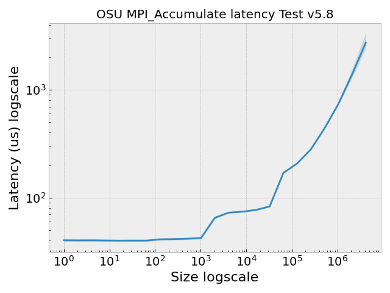
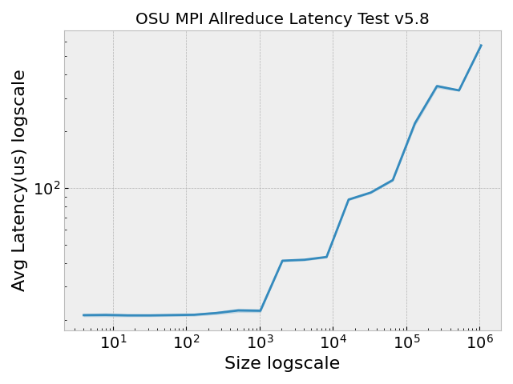
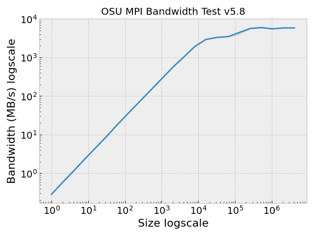
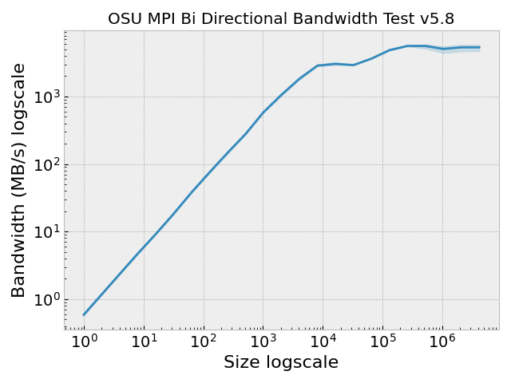
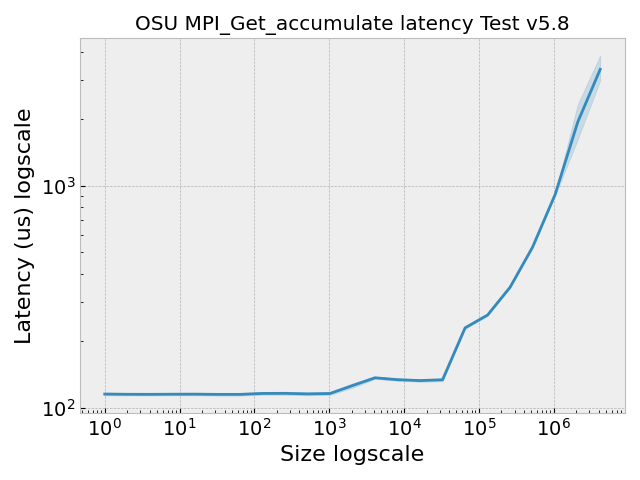
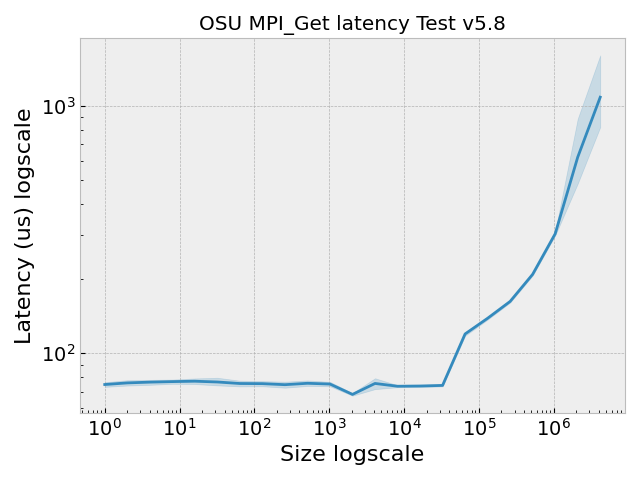
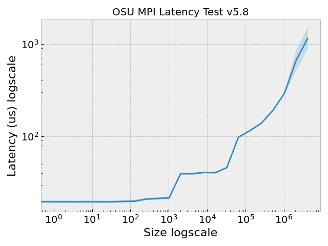
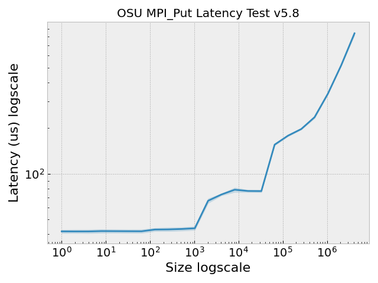

# OSU Benchmark without Sole Tenancy

I wasn't able to create a 2 node cluster with sole tenancy, so I'm going to create one without.
This should at least give us some useful metrics for the OSU benchmarks if someone cannot pay
for sole tenancy.

 - 2 instances of c3-standard-176 should be under $200 for 2 hours.
 - no extra for TIER-1 (normally it's about 1/4 of the cluster cost)
 - 352 GB RAM
 - 176 vCPU which is 88 CPU

For the benchmarks, these are recommended:

 - osu_bibw          - Bidirectional Bandwidth Test
 - osu_bw            - Bandwidth Test
 - osu_latency       - Latency Test
 - osu_put_latency   - Latency Test for Put
 - osu_get_latency   - Latency Test for Get
 - osu_acc_latency   - Latency Test for Accumulate
 - osu_allreduce     - MPI_Allreduce Latency Test

These are what I'm running:

- osu_get_acc_latency
- osu_acc_latency
- osu_fop_latency
- osu_get_latency
- osu_put_latency
- osu_allreduce
- osu_latency
- osu_bibw
- osu_bw

This is a slightly extended set. I'm unsure about the flags for the allreduce - I've seen it with more than 2 np and
I think it might be done both ways but need to check. I also want to note that I manually ran a first few test runs,
and the times were really strangely slow, almost like it "warmed up" after. It's hard to capture that. What I could capture is
that every few runs I saw an error like this (where nothing would run):

<details>

<summary>Complete Failure</summary>

```console
Number of tasks (nproc on one node) is 88
Number of tasks total (across 2 nodes) is 176
Sleeping for 10 seconds waiting for network...
METADATA START {"pods":2,"completions":2,"metricName":"network-osu-benchmark","metricDescription":"point to point MPI benchmarks","metricType":"standalone","metricOptions":{"completions":0,"rate":10,"tasks":0},"metricListOptions":{"commands":["osu_get_acc_latency","osu_acc_latency","osu_fop_latency","osu_get_latency","osu_put_latency","osu_allreduce","osu_latency","osu_bibw","osu_bw"]}}
METADATA END
METRICS OPERATOR COLLECTION START
METRICS OPERATOR TIMEPOINT
mpirun --hostfile ./hostfile.txt --allow-run-as-root -N 2 -np 2 -map-by ppr:1:node /opt/osu-benchmark/build.openmpi/libexec/osu-micro-benchmarks/mpi/one-sided/osu_get_acc_latency
--------------------------------------------------------------------------
Your job has requested more processes than the ppr for
this topology can support:

  App: /opt/osu-benchmark/build.openmpi/libexec/osu-micro-benchmarks/mpi/one-sided/osu_get_acc_latency
  Number of procs:  2
  PPR: 1:node

Please revise the conflict and try again.
--------------------------------------------------------------------------
METRICS OPERATOR TIMEPOINT
mpirun --hostfile ./hostfile.txt --allow-run-as-root -N 2 -np 2 -map-by ppr:1:node /opt/osu-benchmark/build.openmpi/libexec/osu-micro-benchmarks/mpi/one-sided/osu_acc_latency
--------------------------------------------------------------------------
Your job has requested more processes than the ppr for
this topology can support:

  App: /opt/osu-benchmark/build.openmpi/libexec/osu-micro-benchmarks/mpi/one-sided/osu_acc_latency
  Number of procs:  2
  PPR: 1:node

Please revise the conflict and try again.
--------------------------------------------------------------------------
METRICS OPERATOR TIMEPOINT
mpirun --hostfile ./hostfile.txt --allow-run-as-root -N 2 -np 2 -map-by ppr:1:node /opt/osu-benchmark/build.openmpi/libexec/osu-micro-benchmarks/mpi/one-sided/osu_fop_latency
--------------------------------------------------------------------------
Your job has requested more processes than the ppr for
this topology can support:

  App: /opt/osu-benchmark/build.openmpi/libexec/osu-micro-benchmarks/mpi/one-sided/osu_fop_latency
  Number of procs:  2
  PPR: 1:node

Please revise the conflict and try again.
--------------------------------------------------------------------------
METRICS OPERATOR TIMEPOINT
mpirun --hostfile ./hostfile.txt --allow-run-as-root -N 2 -np 2 -map-by ppr:1:node /opt/osu-benchmark/build.openmpi/libexec/osu-micro-benchmarks/mpi/one-sided/osu_get_latency
--------------------------------------------------------------------------
Your job has requested more processes than the ppr for
this topology can support:

  App: /opt/osu-benchmark/build.openmpi/libexec/osu-micro-benchmarks/mpi/one-sided/osu_get_latency
  Number of procs:  2
  PPR: 1:node

Please revise the conflict and try again.
--------------------------------------------------------------------------
METRICS OPERATOR TIMEPOINT
mpirun --hostfile ./hostfile.txt --allow-run-as-root -N 2 -np 2 -map-by ppr:1:node /opt/osu-benchmark/build.openmpi/libexec/osu-micro-benchmarks/mpi/one-sided/osu_put_latency
--------------------------------------------------------------------------
Your job has requested more processes than the ppr for
this topology can support:

  App: /opt/osu-benchmark/build.openmpi/libexec/osu-micro-benchmarks/mpi/one-sided/osu_put_latency
  Number of procs:  2
  PPR: 1:node

Please revise the conflict and try again.
--------------------------------------------------------------------------
METRICS OPERATOR TIMEPOINT
mpirun --hostfile ./hostfile.txt --allow-run-as-root -N 2 -np 2 -map-by ppr:1:node -rank-by core /opt/osu-benchmark/build.openmpi/libexec/osu-micro-benchmarks/mpi/collective/osu_allreduce
--------------------------------------------------------------------------
Your job has requested more processes than the ppr for
this topology can support:

  App: /opt/osu-benchmark/build.openmpi/libexec/osu-micro-benchmarks/mpi/collective/osu_allreduce
  Number of procs:  2
  PPR: 1:node

Please revise the conflict and try again.
--------------------------------------------------------------------------
METRICS OPERATOR TIMEPOINT
mpirun --hostfile ./hostfile.txt --allow-run-as-root -N 2 -np 2 -map-by ppr:1:node /opt/osu-benchmark/build.openmpi/libexec/osu-micro-benchmarks/mpi/pt2pt/osu_latency
--------------------------------------------------------------------------
Your job has requested more processes than the ppr for
this topology can support:

  App: /opt/osu-benchmark/build.openmpi/libexec/osu-micro-benchmarks/mpi/pt2pt/osu_latency
  Number of procs:  2
  PPR: 1:node

Please revise the conflict and try again.
--------------------------------------------------------------------------
METRICS OPERATOR TIMEPOINT
mpirun --hostfile ./hostfile.txt --allow-run-as-root -N 2 -np 2 -map-by ppr:1:node /opt/osu-benchmark/build.openmpi/libexec/osu-micro-benchmarks/mpi/pt2pt/osu_bibw
--------------------------------------------------------------------------
Your job has requested more processes than the ppr for
this topology can support:

  App: /opt/osu-benchmark/build.openmpi/libexec/osu-micro-benchmarks/mpi/pt2pt/osu_bibw
  Number of procs:  2
  PPR: 1:node

Please revise the conflict and try again.
--------------------------------------------------------------------------
METRICS OPERATOR TIMEPOINT
mpirun --hostfile ./hostfile.txt --allow-run-as-root -N 2 -np 2 -map-by ppr:1:node /opt/osu-benchmark/build.openmpi/libexec/osu-micro-benchmarks/mpi/pt2pt/osu_bw
--------------------------------------------------------------------------
Your job has requested more processes than the ppr for
this topology can support:

  App: /opt/osu-benchmark/build.openmpi/libexec/osu-micro-benchmarks/mpi/pt2pt/osu_bw
  Number of procs:  2
  PPR: 1:node

Please revise the conflict and try again.
--------------------------------------------------------------------------
METRICS OPERATOR COLLECTION END
```

</details>

I think what was happening is that it took often 30 seconds to a minute to terminate, but if I started
the new set before that was complete, the new second worker pod could not create 
and then the launcher pod would start running and not have a second node. I tried to fix this by 
adding an additional sleep of one minute after the run, and this resolved the error. The runs we have are:

 - [img/run1](img/run1) is without the sleep (10 runs, so every other one failed)
 - [img/run2](img/run2) is with the sleep! That seemed to resolve the issue.

Run2 is the successful run with the added sleep, and is reproducible using the current [run-metric.py](run-metric.py).

## 0. Create the GKE cluster

I created the cluster with the correct instance type and size, and compact mode.
I didn't choose the node cache since we are just doing a two node setup
and I want a more true "vanilla" setup.

```bash
gcloud container clusters create osu-cluster \
    --region us-central1 \
    --threads-per-core=1 \
    --placement-type=COMPACT \
    --node-locations us-central1-a \
    --num-nodes=2 \
    --machine-type=c3-standard-176
```

Note that since we are using 2 nodes, 2 cpu, we probably don't need the 176 size, but I want to be
consistent so if we run these again and need it, we already have used it here. I'm also hoping
that asking for this "largest" (as I can see) size gives us actually one node.

## 2. Setup the Metrics Operator

Let's install JobSet first:

```bash
VERSION=v0.2.0
kubectl apply --server-side -f https://github.com/kubernetes-sigs/jobset/releases/download/$VERSION/manifests.yaml
```

And then I was using this release of the Metrics Operator:

```bash
$ kubectl apply -f https://github.com/converged-computing/metrics-operator/releases/download/0.0.16.2/metrics-operator.yaml
```

Note that I dumped manifests created by the operator in [manifests](manifests) if you don't want to use the operator
with [metrics.yaml](metrics.yaml). Please be mindful of the mpirun flags and the resources (limits and requests)
set in the JobSet.

## 3. Experiments

Now let's run the experiments. We can do a test run first:

```bash
# Test run
python run-metric.py --iter 1
```

Importantly, the resource specification in [metrics.yaml](metrics.yaml) should ensure there is 1pod/1node. We can check:

```bash
kubectl get pods -o wide
```
```console
NAME                           READY   STATUS    RESTARTS   AGE   IP           NODE                                         NOMINATED NODE   READINESS GATES
metricset-sample-l-0-0-b7kqk   1/1     Running   0          60s   10.96.0.14   gke-osu-cluster-default-pool-f9dc4a7d-t6nx   <none>           <none>
metricset-sample-w-0-0-2q9vw   1/1     Running   0          60s   10.96.1.10   gke-osu-cluster-default-pool-f9dc4a7d-djrv   <none>           <none>
```
In the above, the two nodes should be different! When it finishes running, you should have a [metrics.json](metrics.json). You can also check the log manually
as it runs to sanity check there aren't errors. Here is what I saw:

<details>

<summary>Launcher output</summary>

```console
$ kubectl logs metricset-sample-l-0-0-b7kqk -f
Number of tasks (nproc on one node) is 88
Number of tasks total (across 2 nodes) is 176
Sleeping for 10 seconds waiting for network...
METADATA START {"pods":2,"completions":2,"metricName":"network-osu-benchmark","metricDescription":"point to point MPI benchmarks","metricType":"standalone","metricOptions":{"completions":0,"rate":10,"tasks":0},"metricListOptions":{"commands":["osu_get_acc_latency","osu_acc_latency","osu_fop_latency","osu_get_latency","osu_put_latency","osu_allreduce","osu_latency","osu_bibw","osu_bw"]}}
METADATA END
METRICS OPERATOR COLLECTION START
METRICS OPERATOR TIMEPOINT
mpirun --hostfile ./hostfile.txt --allow-run-as-root -N 2 -np 2 -map-by ppr:1:node /opt/osu-benchmark/build.openmpi/libexec/osu-micro-benchmarks/mpi/one-sided/osu_get_acc_latency
# OSU MPI_Get_accumulate latency Test v5.8
# Window creation: MPI_Win_create
# Synchronization: MPI_Win_lock/unlock
# Size          Latency (us)
1                     109.91
2                     109.82
4                     109.76
8                     111.53
16                    112.71
32                    110.37
64                    109.68
128                   110.45
256                   111.15
512                   110.64
1024                  111.30
2048                  121.17
4096                  132.28
8192                  129.21
16384                 129.81
32768                 124.58
65536                 217.39
131072                261.18
262144                354.74
524288                561.32
1048576               952.29
2097152              2169.33
4194304              3683.71
METRICS OPERATOR TIMEPOINT
mpirun --hostfile ./hostfile.txt --allow-run-as-root -N 2 -np 2 -map-by ppr:1:node /opt/osu-benchmark/build.openmpi/libexec/osu-micro-benchmarks/mpi/one-sided/osu_acc_latency
# OSU MPI_Accumulate latency Test v5.8
# Window creation: MPI_Win_allocate
# Synchronization: MPI_Win_flush
# Size          Latency (us)
1                      39.17
2                      38.77
4                      38.92
8                      38.85
16                     38.89
32                     38.98
64                     39.11
128                    40.24
256                    40.60
512                    40.74
1024                   41.22
2048                   70.60
4096                   71.45
8192                   72.99
16384                  79.61
32768                  85.72
65536                 164.04
131072                204.72
262144                272.43
524288                421.89
1048576               705.49
2097152              1271.41
4194304              2345.60
METRICS OPERATOR TIMEPOINT
mpirun --hostfile ./hostfile.txt --allow-run-as-root -N 2 -np 2 -map-by ppr:1:node /opt/osu-benchmark/build.openmpi/libexec/osu-micro-benchmarks/mpi/one-sided/osu_fop_latency
# OSU MPI_Fetch_and_op latency Test v5.8
# Window creation: MPI_Win_allocate
# Synchronization: MPI_Win_flush
# Size          Latency (us)
8                      78.63
METRICS OPERATOR TIMEPOINT
mpirun --hostfile ./hostfile.txt --allow-run-as-root -N 2 -np 2 -map-by ppr:1:node /opt/osu-benchmark/build.openmpi/libexec/osu-micro-benchmarks/mpi/one-sided/osu_get_latency
# OSU MPI_Get latency Test v5.8
# Window creation: MPI_Win_allocate
# Synchronization: MPI_Win_flush
# Size          Latency (us)
1                      72.75
2                      72.70
4                      72.86
8                      72.92
16                     72.96
32                     72.54
64                     72.21
128                    72.60
256                    72.76
512                    80.03
1024                   72.73
2048                   69.12
4096                   84.19
8192                   74.31
16384                  74.88
32768                  75.60
65536                 129.59
131072                134.72
262144                150.26
524288                189.26
1048576               252.72
2097152               463.22
4194304               699.81
METRICS OPERATOR TIMEPOINT
mpirun --hostfile ./hostfile.txt --allow-run-as-root -N 2 -np 2 -map-by ppr:1:node /opt/osu-benchmark/build.openmpi/libexec/osu-micro-benchmarks/mpi/one-sided/osu_put_latency
# OSU MPI_Put Latency Test v5.8
# Window creation: MPI_Win_allocate
# Synchronization: MPI_Win_flush
# Size          Latency (us)
1                      39.13
2                      39.23
4                      39.43
8                      38.99
16                     38.53
32                     38.50
64                     39.26
128                    40.65
256                    40.75
512                    41.05
1024                   41.30
2048                   69.67
4096                   71.05
8192                   64.85
16384                  73.87
32768                  76.30
65536                 148.61
131072                170.70
262144                185.15
524288                212.02
1048576               304.07
2097152               465.60
4194304               816.53
METRICS OPERATOR TIMEPOINT
mpirun --hostfile ./hostfile.txt --allow-run-as-root -N 2 -np 2 -map-by ppr:1:node -rank-by core /opt/osu-benchmark/build.openmpi/libexec/osu-micro-benchmarks/mpi/collective/osu_allreduce

# OSU MPI Allreduce Latency Test v5.8
# Size       Avg Latency(us)
4                      20.56
8                      20.35
16                     20.64
32                     20.46
64                     20.49
128                    20.59
256                    20.94
512                    21.28
1024                   21.36
2048                   40.07
4096                   40.94
8192                   42.11
16384                  84.91
32768                  91.19
65536                 105.53
131072                241.87
262144                285.76
524288                316.45
1048576               558.56
METRICS OPERATOR TIMEPOINT
mpirun --hostfile ./hostfile.txt --allow-run-as-root -N 2 -np 2 -map-by ppr:1:node /opt/osu-benchmark/build.openmpi/libexec/osu-micro-benchmarks/mpi/pt2pt/osu_latency
# OSU MPI Latency Test v5.8
# Size          Latency (us)
0                      19.17
1                      19.11
2                      19.22
4                      19.20
8                      19.18
16                     19.12
32                     19.18
64                     19.22
128                    19.26
256                    20.37
512                    20.62
1024                   20.87
2048                   39.07
4096                   39.10
8192                   39.87
16384                  40.62
32768                  44.72
65536                  96.54
131072                109.25
262144                124.30
524288                166.29
1048576               265.00
2097152               407.44
4194304               720.24
METRICS OPERATOR TIMEPOINT
mpirun --hostfile ./hostfile.txt --allow-run-as-root -N 2 -np 2 -map-by ppr:1:node /opt/osu-benchmark/build.openmpi/libexec/osu-micro-benchmarks/mpi/pt2pt/osu_bibw
# OSU MPI Bi-Directional Bandwidth Test v5.8
# Size      Bandwidth (MB/s)
1                       0.60
2                       1.20
4                       2.41
8                       4.80
16                      9.38
32                     18.60
64                     38.38
128                    76.61
256                   147.79
512                   279.71
1024                  597.53
2048                 1121.87
4096                 2041.92
8192                 3185.37
16384                3406.73
32768                3184.66
65536                3718.85
131072               5100.29
262144               5756.79
524288               5996.96
1048576              5705.72
2097152              5882.81
4194304              5826.52
METRICS OPERATOR TIMEPOINT
mpirun --hostfile ./hostfile.txt --allow-run-as-root -N 2 -np 2 -map-by ppr:1:node /opt/osu-benchmark/build.openmpi/libexec/osu-micro-benchmarks/mpi/pt2pt/osu_bw
# OSU MPI Bandwidth Test v5.8
# Size      Bandwidth (MB/s)
1                       0.29
2                       0.59
4                       1.17
8                       2.37
16                      4.65
32                      9.32
64                     19.02
128                    37.26
256                    75.18
512                   144.24
1024                  281.27
2048                  636.85
4096                 1137.48
8192                 2094.83
16384                3003.35
32768                3539.25
65536                3831.42
131072               5106.71
262144               6104.91
524288               6243.19
1048576              5576.57
2097152              5977.91
4194304              5939.50
METRICS OPERATOR COLLECTION END
```

</details>

At this point we can do an actual run (20x). Note that it will over-ride the existing data / image files:

```bash
# Actual run
python run-metric.py --iter 20
```

## Cleanup

When you are done, cleanup:

```bash
gcloud container clusters delete osu-benchmarks --region us-central1
```

## Results

Here are results from the second run (with 20x). The plots are generated automatically with the run-metric.py script.










The plots show the logscale of the metriscs included, and the error bars are a 95% confidence interval.
There are 20 runs (and they all completed for run2). 