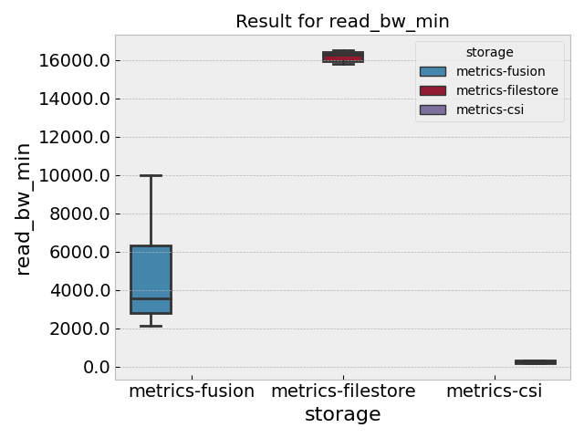
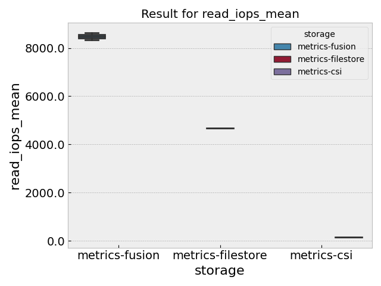
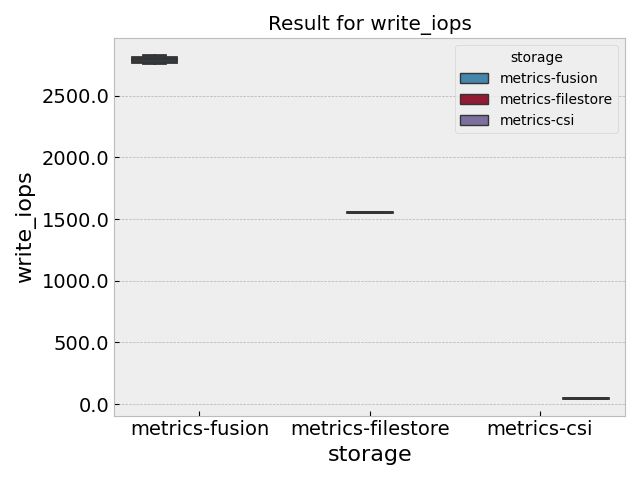
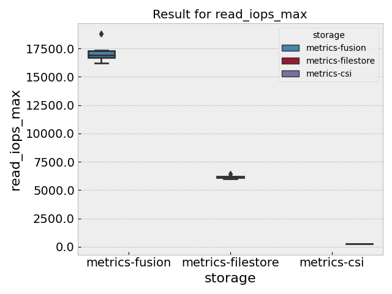
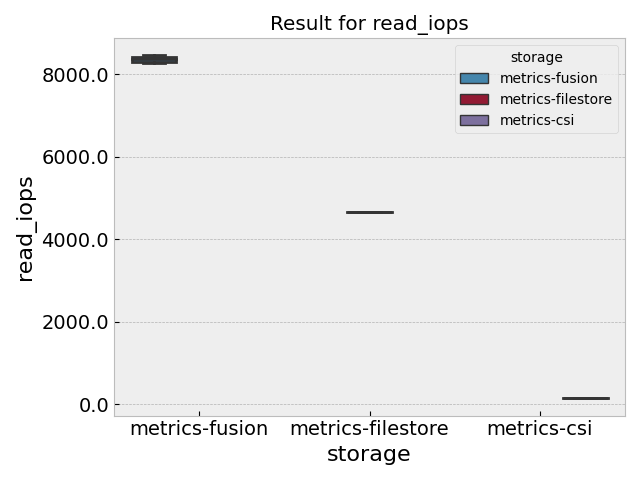
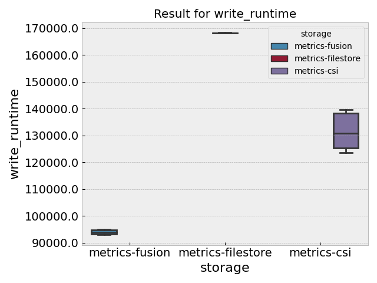
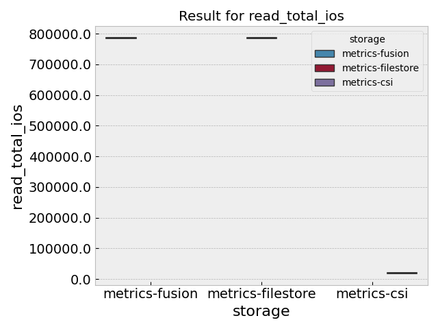
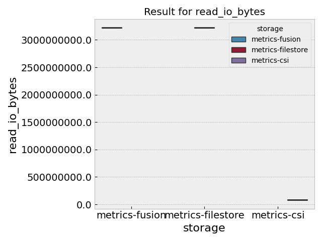
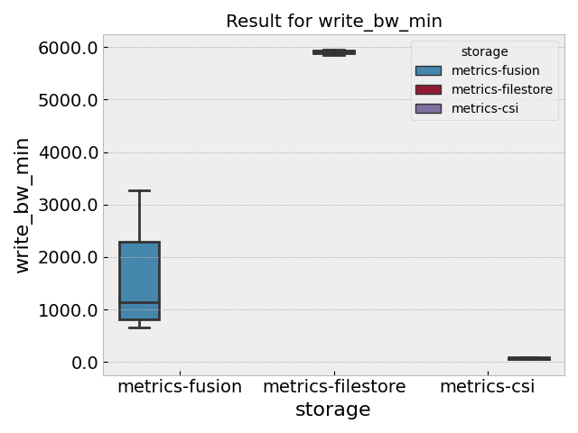
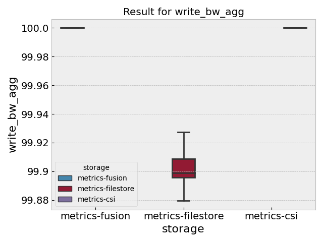

# Google Storage Example

For these experiments, we will create a small cluster on Google Cloud, and attempt
to demonstrate measuring IO stats for different kinds of storage, including:

 - host volume (e.g., a volume on the Google VM)
 - Google Filestore
 - Google Container Storage Interface (CSI) driver

We will be using the [FIO metric](https://converged-computing.github.io/metrics-operator/getting_started/metrics.html#fio) of the Metrics operator.

## Usage

### 1. Create the Cluster

First, create your cluster with the Filestore CSI Driver enabled:

```bash
GOOGLE_PROJECT=myproject
```
```bash
$ gcloud container clusters create flux-cluster --project $GOOGLE_PROJECT \
    --zone us-central1-a --machine-type n1-standard-2 \
    --addons=GcpFilestoreCsiDriver \
    --num-nodes=2 --enable-network-policy --tags=flux-cluster --enable-intra-node-visibility
```

### 2. Install JobSet

We also need to install JobSet

```bash
VERSION=v0.2.0
kubectl apply --server-side -f https://github.com/kubernetes-sigs/jobset/releases/download/$VERSION/manifests.yaml
```

### 3. Install the Metrics Operator

Let's next install the operator. You can [choose one of the options here](https://converged-computing.github.io/metrics-operator/getting_started/user-guide.html). 
E.g., to deploy from the cloned repository:

```bash
$ kubectl apply -f https://raw.githubusercontent.com/converged-computing/metrics-operator/main/examples/dist/metrics-operator.yaml
```

### 4. Prepare volume claims

Storage is neat because we can prepare several PVCs, and then have the operator test making a request to write to each one.
For this first experiment I'm interested in looking at tests when we have several PVCs mounted to different spots, vs.
running the experiments separately. I'll start with running them separately first since I have never done that before.

#### Filestore

Let's test Filestore first, because it's worked for me best in the past. First, create the PVC:

```bash
$ kubectl apply -f pvc-filestore.yaml
```

The storage class we are testing is derived from this list:

```bash
$ kubectl get storageclass
```

And check on the status:

```bash
$ kubectl get pvc
NAME   STATUS    VOLUME   CAPACITY   ACCESS MODES   STORAGECLASS   AGE
data   Pending                                      standard-rwx   6s
```

Note that (in my experience) the Filestore takes ~3 minutes to get working. You'll want to see that the volume was provisioned
via:

```bash
kubectl describe pvc
```

Prepare a data directory:

```bash
mkdir -p data
```

Now let's run the filestore experiment, which will request the volume and also save the metrics. Let's do this multiple times.

> Question, should we allow the looping within the storage operator so we get all the collections in one file, or is one run enough?

```bash
for i in 0 1 2 3 4 5; do
  echo "Running iteration $i"
  python run-metric.py metrics-filestore.yaml --out ./data/metrics-filestore-$i.json
  kubectl delete -f metrics-filestore.yaml
done
```

After we are done with filestore we can manually delete the volume (I think I forgot to add the owner reference?)

```bash
$ kubectl delete -f pvc-filestore.yaml
$ kubectl delete pv pvc-c3b2b67f-b7c7-4e67-8459-2ba84904f6d8
```

#### Local Volume

Now let's do a local volume! This one doesn't require any special setup. Note that I had to change the size here
to be smaller, because:

```bash
fio: ENOSPC on laying out file, stopping
fio: pid=0, err=28/file:filesetup.c:240, func=write, error=No space left on device
```
So this won't be a perfectly fair comparison! I didn't know this in advance. Here is how to check:

```bash
kubectl get nodes
$ kubectl get nodes -o json | jq .items[0].status.capacity
```
```console
{
  "cpu": "2",
  "ephemeral-storage": "98831908Ki",
  "hugepages-1Gi": "0",
  "hugepages-2Mi": "0",
  "memory": "7629484Ki",
  "pods": "110"
}
```

Lol oops. But it ultimately didn't work:

```bash
fio: looks like your file system does not support direct=1/buffered=0
fio: destination does not support O_DIRECT
fio: pid=15, err=22/file:filesetup.c:805, func=open(/tmp/workflow/test-7987dc501b330234348514f2c63285f1), error=Invalid argument
```
I was hoping to get a host volume for a baseline, but this might not be possible! Let's skip for now.


#### CSI Driver

Now let's test a csi driver that binds to Google storage. This assumes that you have a Google Storage bucket
ready to go. We are going to test [this driver](https://ofek.dev/csi-gcs/getting_started/) that requires a stateful set and daemon set to work.
We are going to follow the [dynamic example setup here](https://github.com/ofek/csi-gcs/tree/master/examples/dynamic). Let's install first.

```bash
$ kubectl apply -k "github.com/ofek/csi-gcs/deploy/overlays/stable?ref=v0.9.0"
$ kubectl get CSIDriver,daemonsets,pods -n kube-system | grep csi
```

And to debug:

```bash
$ kubectl logs -l app=csi-gcs -c csi-gcs -n kube-system
```

As you are working, if the mounts seem to work but you don't see files, keep
in mind you need to be aware of [implicit directories](https://ofek.dev/csi-gcs/dynamic_provisioning/#extra-flags).
You probably want to create a [service account for storage](https://ofek.dev/csi-gcs/dynamic_provisioning/#permission).
Then create a secret pointing to your service account key with access to storage:

```bash
kubectl create secret generic csi-gcs-secret-mounter --from-file=key=<PATH_TO_SERVICE_ACCOUNT_KEY_1>
kubectl create secret generic csi-gcs-secret-creator --from-file=key=<PATH_TO_SERVICE_ACCOUNT_KEY_2> --from-literal=projectId=$GOOGLE_PROJECT
```

Now we have a secret for the storage and the driver - will it work? Let's create the PVC:

```bash
kubectl create -f storageclass-csi.yaml
```

**Important** the bucket / project / etc are defined in this storage class! The bucket should already be created.
And then create the pvc:

```bash
kubectl apply -f pvc-csi.yaml
```

Now this should request a volume created when we create our storage metric pods! Note that this was slow and I needed
to decrease the size for it to run in a few minutes.

```bash
for i in 2 3 4 5; do
  echo "Running iteration $i"
  python run-metric.py metrics-csi.yaml --out ./data/metrics-csi-$i.json
  kubectl delete -f metrics-csi.yaml
done
```

When you are done, clean up the drivers and secrets.

```bash
$ kubectl delete -k "github.com/ofek/csi-gcs/deploy/overlays/stable?ref=v0.9.0"
$ kubectl delete secret csi-gcs-secret-mounter
$ kubectl delete secret csi-gcs-secret-creator
```

Since this was all we could do with this cluster, at this point I deleted it.

```bash
$ gcloud container clusters delete flux-cluster
```

#### Fusion

**TBA** we will need a few more features added to the metrics-operator.

For fusion I needed to make a new cluster and [follow the basic instructions here](https://flux-framework.org/flux-operator/deployment/google/fusion.html?h=fusion#create-cluster).
Note that it's not fair to compare the different setups (for something like a paper)
but this experiment should be OK because we just want to get it working.

```bash
gcloud container clusters create flux-cluster --project $GOOGLE_PROJECT \
    --zone us-central1-a --machine-type n1-standard-2 --cluster-version 1.25 \
    --num-nodes=2 --enable-network-policy --tags=flux-cluster --enable-intra-node-visibility \
    --ephemeral-storage-local-ssd count=1 --workload-pool=${GOOGLE_PROJECT}.svc.id.goog \
    --workload-metadata=GKE_METADATA
```

Note that I had already created the service account, etc. So I just needed to associate it with the cluster.

```bash
KSA_NAME="flux-operator-sa"
GOOGLE_SERVICE_ACCOUNT=GSA_NAME@GSA_PROJECT.iam.gserviceaccount.com
GOOGLE_SERVICE_ACCOUNT=flux-operator-sa@llnl-flux.iam.gserviceaccount.com
kubectl annotate serviceaccount ${KSA_NAME} \
    --namespace default \
    iam.gke.io/gcp-service-account=${GOOGLE_SERVICE_ACCOUNT}
```

We can test fusion with a pre command to get the library...

## Results

And plot the small results we have! I only chose attributes from read/write/trim as those seemed to be more means or averages?

```bash
python plot-results.py
```

























## Questions I have:

- Is the loop method above OK, or should we try to run inside one mount / consistent pod for some number of iterations?
- Let's make a list of storage CSI to test, likely one list per cloud (and fusion from Nextflow)
- Is there a robust set of experiments we can do that would be talk / paper worthy?

Note that for [fusion](https://flux-framework.org/flux-operator/deployment/google/fusion.html?h=fusion#create-cluster) we need requests/limits for resources, and likely a pre-command section to set it up (or a faux application
container that will set it up).

## Clean Up

When you are done, cleanup the cluster

```bash
$ gcloud container clusters delete flux-cluster
```

And that's it! We will write functions to plot the results.