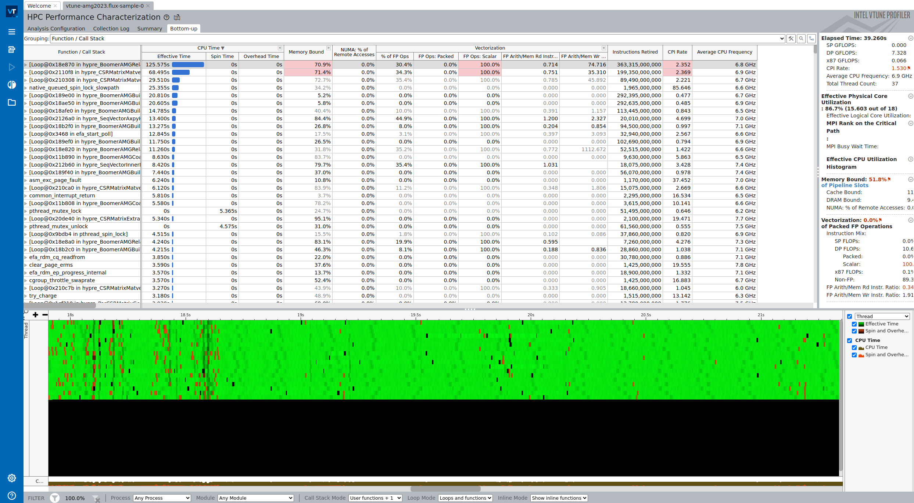

# VTune Experiment On AWS

## Experiment

### 1. Setup

Bring up the cluster (with 4 nodes). Have your GitHub packages (or other registry credential / token) ready. This does not work.

Let's prototype the CPU runs with vtune. Create the cluster:

```bash
time eksctl create cluster --config-file ./eks-config.yaml
```

Total time: 15 minutes

Install the Flux Operator:

```bash
kubectl apply -f https://raw.githubusercontent.com/flux-framework/flux-operator/main/examples/dist/flux-operator.yaml
```
Now we are ready for different MiniCluster setups. For each of the below, to shell in to the lead broker (index 0) you do:

```bash
kubectl exec -it flux-sample-0-xxx bash
```

Note that the configs are currently set to 4 nodes, and 94 cpu each. Check efa:

```
# fi_info  | grep efa
provider: efa
    fabric: efa
    domain: efa_0-rdm
provider: efa
    fabric: efa
    domain: efa_0-dgrm
```

Check for vPMU support:

```bash
cat /proc/cpuinfo | grep arch_perfmon
```

### 2. Applications

#### AMG2023

Create the minicluster and shell in.

```bash
kubectl apply -f ./crd/amg2023.yaml
time kubectl wait --for=condition=ready pod -l job-name=flux-sample --timeout=600s
```
This one requires sourcing spack

```bash
. /etc/profile.d/z10_spack_environment.sh
flux proxy local:///mnt/flux/view/run/flux/local bash
```

```console
oras login ghcr.io --username vsoch
app=amg2023

time flux run -N 2 -n 36 -o cpu-affinity=per-task vtune -collect hpc-performance -data-limit=0 -r vtune-$app amg -P 3 3 4 -n 128 128 128 |& tee ./result.out

mv result.out vtune-$app.flux-sample-0/
output=vtune-$app.flux-sample-0/

vtune -report callstacks -r $output -format=csv > $output/callstacks.csv
vtune -report hotspots -r $output -format=csv > $output/hotspots.csv
oras push ghcr.io/converged-computing/metrics-operator-experiments/performance-vtune:test-aws-$app $output
```

Clean up!

```bash
kubectl delete -f ./crd/amg2023.yaml
```

#### Kripke

```bash
kubectl apply -f ./crd/kripke.yaml
time kubectl wait --for=condition=ready pod -l job-name=flux-sample --timeout=600s
```

```bash
flux proxy local:///mnt/flux/view/run/flux/local bash
```

```console
oras login ghcr.io --username vsoch
app=kripke

time flux run -N 2 -n 36 -o cpu-affinity=per-task vtune -collect hpc-performance -data-limit=0 -r vtune-$app kripke --layout GDZ --dset 8 --zones 36,36,36 --gset 16 --groups 64 --niter 100 --legendre 9 --quad 8 --procs 3,3,4 |& tee ./result.out

mv result.out vtune-$app.flux-sample-0/
output=vtune-$app.flux-sample-0/

vtune -report callstacks -r $output -format=csv > $output/callstacks.csv
vtune -report hotspots -r $output -format=csv > $output/hotspots.csv
oras push ghcr.io/converged-computing/metrics-operator-experiments/performance-vtune:test-aws-$app $output
```

```bash
kubectl delete -f ./crd/kripke.yaml
```

#### Linpack

```bash
kubectl apply -f ./crd/linpack.yaml
time kubectl wait --for=condition=ready pod -l job-name=flux-sample --timeout=600s
```

```bash
flux proxy local:///mnt/flux/view/run/flux/local bash
```

```console
oras login ghcr.io --username vsoch
app=linpack

time flux run -N 2 -n 36 -o cpu-affinity=per-task vtune -collect hpc-performance -data-limit=0 -r vtune-$app xhpl |& tee ./result.out

mv result.out vtune-$app.flux-sample-0/
output=vtune-$app.flux-sample-0/

vtune -report callstacks -r $output -format=csv > $output/callstacks.csv
vtune -report hotspots -r $output -format=csv > $output/hotspots.csv
oras push ghcr.io/converged-computing/metrics-operator-experiments/performance-vtune:test-aws-$app $output
```

```bash
kubectl delete -f ./crd/linpack.yaml
```

#### Laghos

```bash
kubectl apply -f ./crd/laghos.yaml
time kubectl wait --for=condition=ready pod -l job-name=flux-sample --timeout=600s
```

```bash
flux proxy local:///mnt/flux/view/run/flux/local bash
```

```console
oras login ghcr.io --username vsoch
app=laghos

time flux run -N 2 -n 36 -o cpu-affinity=per-task vtune -collect hpc-performance -data-limit=0 -r vtune-$app /opt/laghos/laghos -p 1 -m ./data/box01_hex.mesh -rs 2 -tf 0.6 -pa -cfl 0.08 --max-steps 300 |& tee ./result.out

mv result.out vtune-$app.flux-sample-0/
output=vtune-$app.flux-sample-0/

vtune -report callstacks -r $output -format=csv > $output/callstacks.csv
vtune -report hotspots -r $output -format=csv > $output/hotspots.csv
oras push ghcr.io/converged-computing/metrics-operator-experiments/performance-vtune:test-aws-$app $output
```

```bash
kubectl delete -f ./crd/laghos.yaml --wait
```

#### LAMMPS

```bash
kubectl apply -f ./crd/lammps.yaml
time kubectl wait --for=condition=ready pod -l job-name=flux-sample --timeout=600s
```

```bash
flux proxy local:///mnt/flux/view/run/flux/local bash
```

```console
oras login ghcr.io --username vsoch
app=lammps

flux run -N2 -n 36 -c 1 -o cpu-affinity=per-task vtune -collect hpc-performance -data-limit=0 -r vtune-$app lmp -in in.snap.test -var snapdir 2J8_W.SNAP -v x 228 -v y 228 -v z 228 -var nsteps 20000 |& tee ./result.out

mv log.lammps vtune-lammps.flux-sample-0/
mv result.out vtune-lammps.flux-sample-0/
output=vtune-lammps.flux-sample-0/

vtune -report callstacks -r $output -format=csv > $output/callstacks.csv
vtune -report hotspots -r $output -format=csv > $output/hotspots.csv
oras push ghcr.io/converged-computing/metrics-operator-experiments/performance-vtune:test-aws-$app $output
```

```bash
kubectl delete -f ./crd/lammps.yaml --wait
```

#### MiniFE

```bash
kubectl apply -f ./crd/minife.yaml
time kubectl wait --for=condition=ready pod -l job-name=flux-sample --timeout=600s
```

```bash
flux proxy local:///mnt/flux/view/run/flux/local bash
```

```console
oras login ghcr.io --username vsoch
app=minife

time flux run -N 2 -n 36 -o cpu-affinity=per-task vtune -collect hpc-performance -data-limit=0 -r vtune-$app miniFE.x nx=620 ny=620 nz=620 num_devices=4 use_locking=1 elem_group_size=2 use_elem_mat_fields=10 verify_solution=0 |& tee ./result.out

mv result.out vtune-$app.flux-sample-0/
output=vtune-$app.flux-sample-0/

vtune -report callstacks -r $output -format=csv > $output/callstacks.csv
vtune -report hotspots -r $output -format=csv > $output/hotspots.csv
oras push ghcr.io/converged-computing/metrics-operator-experiments/performance-vtune:test-aws-$app $output
```

```bash
kubectl delete -f ./crd/minife.yaml
```

#### Mixbench

```bash
kubectl apply -f ./crd/mixbench.yaml
time kubectl wait --for=condition=ready pod -l job-name=flux-sample --timeout=600s
```

```bash
flux proxy local:///mnt/flux/view/run/flux/local bash
```

```console
oras login ghcr.io --username vsoch
app=mixbench

# I'm only running on one worker, so don't need flux
vtune -collect hpc-performance -data-limit=0 -r vtune-$app /usr/local/bin/mixbench-cpu |& tee ./result.out

mv result.out vtune-$app/
output=vtune-$app

vtune -report callstacks -r $output -format=csv > $output/callstacks.csv
vtune -report hotspots -r $output -format=csv > $output/hotspots.csv
oras push ghcr.io/converged-computing/metrics-operator-experiments/performance-vtune:test-aws-$app $output
```

```bash
kubectl delete -f ./crd/mixbench.yaml
```

#### Mt-Gemm

```bash
kubectl apply -f ./crd/mt-gem.yaml
time kubectl wait --for=condition=ready pod -l job-name=flux-sample --timeout=600s
```
```bash
flux proxy local:///mnt/flux/view/run/flux/local bash
```


```console
oras login ghcr.io --username vsoch
app=mt-gemm

time flux run -N 2 -n 36 -o cpu-affinity=per-task vtune -collect hpc-performance -data-limit=0 -r vtune-$app /opt/dense_linear_algebra/gemm/mpi/build/1_dense_gemm_mpi |& tee ./result.out

mv result.out vtune-$app.flux-sample-0/
output=vtune-$app.flux-sample-0/

vtune -report callstacks -r $output -format=csv > $output/callstacks.csv
vtune -report hotspots -r $output -format=csv > $output/hotspots.csv
oras push ghcr.io/converged-computing/metrics-operator-experiments/performance-vtune:test-aws-$app $output
```

```bash
kubectl delete -f ./crd/mt-gem.yaml
```

#### Nek5000

Note that I'm running this on one node since it doesn't work without a shared filesystem.
I also changed the ending criteria to be a max of 5 minutes.

```console
[GENERAL]
polynomialOrder = 7
stopAt = numSteps
numSteps = 10
```

```bash
kubectl apply -f ./crd/nek5000.yaml
time kubectl wait --for=condition=ready pod -l job-name=flux-sample --timeout=600s
```
```bash
flux proxy local:///mnt/flux/view/run/flux/local bash
```

```console
oras login ghcr.io --username vsoch
app=nek5000

# Again, just running on one node
vtune -collect hpc-performance -data-limit=0 -r vtune-$app nekrs --setup turbPipe.par |& tee ./result.out

mv result.out vtune-$app/
output=vtune-$app/

vtune -report callstacks -r $output -format=csv > $output/callstacks.csv
vtune -report hotspots -r $output -format=csv > $output/hotspots.csv
oras push ghcr.io/converged-computing/metrics-operator-experiments/performance-vtune:test-aws-$app $output
```

```bash
kubectl delete -f ./crd/nek5000.yaml
```

#### OSU

```bash
kubectl apply -f ./crd/osu.yaml
time kubectl wait --for=condition=ready pod -l job-name=flux-sample --timeout=600s
```

```bash
flux proxy local:///mnt/flux/view/run/flux/local bash
```

```console
oras login ghcr.io --username vsoch
app=osu
mkdir -p vtune-osu/

time flux run -N 2 -n 2 -o cpu-affinity=per-task vtune -collect hpc-performance -data-limit=0 -r ./vtune-osu/vtune-$app-bw /opt/osu-benchmark/build.openmpi/mpi/pt2pt/osu_bw |& tee ./result-bw.out

time flux run -N 2 -n 2 -o cpu-affinity=per-task vtune -collect hpc-performance -data-limit=0 -r ./vtune-osu/vtune-$app-latency /opt/osu-benchmark/build.openmpi/mpi/pt2pt/osu_latency |& tee ./result-latency.out

time flux run -N 2 -n 36 -o cpu-affinity=per-task vtune -collect hpc-performance -data-limit=0 -r ./vtune-osu/vtune-$app-allreduce /opt/osu-benchmark/build.openmpi/mpi/collective/osu_allreduce |& tee ./result-allreduce.out

cp result-bw.out ./vtune-osu/vtune-$app-bw.flux-sample-0/result.out
cp result-latency.out ./vtune-osu/vtune-$app-latency.flux-sample-0/result.out
cp result-allreduce.out ./vtune-osu/vtune-$app-allreduce.flux-sample-0/result.out

cd ./vtune-osu
for path in $(ls .) 
  do
    echo $path
    vtune -report callstacks -r $path -format=csv > $path/callstacks.csv
    vtune -report hotspots -r $path -format=csv > $path/hotspots.csv
done

cd ../
output=./vtune-osu
oras push ghcr.io/converged-computing/metrics-operator-experiments/performance-vtune:test-aws-$app $output
```

```bash
kubectl delete -f ./crd/osu.yaml
```


#### Quicksilver

```bash
kubectl apply -f ./crd/quicksilver.yaml
time kubectl wait --for=condition=ready pod -l job-name=flux-sample --timeout=600s
```

```bash
flux proxy local:///mnt/flux/view/run/flux/local bash
```

```console
oras login ghcr.io --username vsoch
app=quicksilver

time flux run -N 2 -n 36 -o cpu-affinity=per-task vtune -collect hpc-performance -data-limit=0 -r vtune-$app qs --inputFile /opt/quicksilver/Examples/CORAL2_Benchmark/Problem1/Coral2_P1.inp |& tee ./result.out

mv result.out vtune-$app.flux-sample-0/
output=vtune-$app.flux-sample-0/

vtune -report callstacks -r $output -format=csv > $output/callstacks.csv
vtune -report hotspots -r $output -format=csv > $output/hotspots.csv
oras push ghcr.io/converged-computing/metrics-operator-experiments/performance-vtune:test-aws-$app $output
```

```bash
kubectl delete -f ./crd/quicksilver.yaml
```

#### Stream

```bash
kubectl apply -f ./crd/stream.yaml
time kubectl wait --for=condition=ready pod -l job-name=flux-sample --timeout=600s
```

```bash
flux proxy local:///mnt/flux/view/run/flux/local bash
```

```console
oras login ghcr.io --username vsoch
app=stream

time flux run -N 2 -n 36 -o cpu-affinity=per-task vtune -collect hpc-performance -data-limit=0 -r vtune-$app ./stream_c.exe |& tee ./result.out

mv result.out vtune-$app.flux-sample-0/
output=vtune-$app.flux-sample-0/

vtune -report callstacks -r $output -format=csv > $output/callstacks.csv
vtune -report hotspots -r $output -format=csv > $output/hotspots.csv
oras push ghcr.io/converged-computing/metrics-operator-experiments/performance-vtune:test-aws-$app $output
```

```bash
kubectl delete -f ./crd/stream.yaml
```

### Clean Up

When you are done:

```bash
time eksctl delete cluster --config-file ./eks-config.yaml --wait
```

Deletion time is 8minutes 46 seconds

**IMPORTANT** AWS has a bug that it won't delete, ever, unless you force delete all pods. It will say:

```
2024-05-25 14:52:56 [!]  1 pods are unevictable from node ip-192-168-19-163.us-east-2.compute.internal
```

And you need to do:

```bash
kubectl delete pods --all-namespaces --all
```

## Exploring Examples

### 1. Download Data

We can loop through the artifacts to download. I usually test to see the tags first:

```bash
for tag in $(oras repo tags ghcr.io/converged-computing/metrics-operator-experiments/performance-vtune)
  do
    echo $tag
done
```
```console
test-aws-lammps
test-aws-kripke
test-aws-linpack
test-aws-amg2023
test-aws-laghos
test-aws-minife
test-aws-mixbench
test-aws-mt-gemm
test-aws-nek5000
test-aws-osu
test-aws-quicksilver
test-aws-stream
```

```console
mkdir -p ./results
cd ./results
for tag in $(oras repo tags ghcr.io/converged-computing/metrics-operator-experiments/performance-vtune)
  do
    oras pull ghcr.io/converged-computing/metrics-operator-experiments/performance-vtune:$tag
done
```

Note that this is how we built the gui
```bash
docker build -f ./vtune-gui/Dockerfile -t ghcr.io/converged-computing/rainbow-experiments:vtune .
docker push ghcr.io/converged-computing/rainbow-experiments:vtune
singularity pull docker://ghcr.io/converged-computing/rainbow-experiments:vtune
```

### 2. View Data

Then shell in, and target the `vtune-gui` to any of the report directories:

```
singularity shell rainbow-experiments_vtune.sif
> vtune-gui ./vtune-amg2023.flux-sample-0
```

That will show you the nice web UI!



I'm going to start exploring these. I'd like to understand the different patterns of application resource usage, even if only for CPU, and for a small set.
